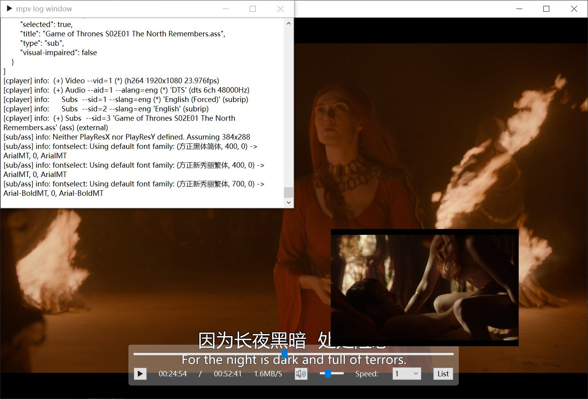

# Qt-Mpv

- [简体中文](README.md)
- [English](README.en.md)

## 编译环境

1. QT6；
2. Windows：[libmpv](https://sourceforge.net/projects/mpv-player-windows/files/libmpv/)；
3. MacOS：`brew install mpv`，先升级brew；
4. Ubuntu：`apt install mpv libmpv-dev`；

## 预览窗口在使用4K视频时，会占用大量内存，因为多开了一个mpv实例，内存double；

**预览窗口使用opengl渲染存在问题，会创建出一个mpv原生播放窗口！！！**

## MacOS好像只能使用[QOpenglWidget](https://github.com/mpv-player/mpv-examples/tree/master/libmpv/qt_opengl)渲染；

```
[vo/gpu] opengl cocoa backend is deprecated, use vo=libmpv instead
```

但是使用 `vo=libmpv`也无法正常显示视频；

使用opengl的版本大于3，性能更好；

```cpp
QSurfaceFormat surfaceFormat;
surfaceFormat.setVersion(3, 3);
surfaceFormat.setProfile(QSurfaceFormat::CoreProfile);
setFormat(surfaceFormat);
QSurfaceFormat::setDefaultFormat(surfaceFormat);
```

## Ubuntu下也好像只能使用[QOpenglWidget](https://github.com/mpv-player/mpv-examples/tree/master/libmpv/qt_opengl)渲染；

```shell
qt.dbus.integration: Could not connect "org.freedesktop.IBus" to globalEngineChanged(QString)
```

## 在Windows和Unix下，ControlWidget和TitleWidget的控制方式不同；
1. Windows下使用`mpv_set_property(d_ptr->mpv, "wid", MPV_FORMAT_INT64, &wid);`，使用layout布局，会使得视频窗口在最前面，遮挡ControlWidget和TitleWidget，所以将ControlWidget和TitleWidget悬浮在视频窗口上方，使用`eventFilter`去处理大部分情况下ControlWidget和TitleWidget的显示，写的非常啰嗦，但是为了能够使用D3D11渲染，更棒的性能，只能这样处理，也是值得的；
2. Unix下使用QOpenGLWidget，使用layout布局更加方便；

## MacOS打包需要[install_name_tool](/mac/change_lib_dependencies.rb)，依赖拷贝脚本文件来自[iina](https://github.com/iina/iina/blob/develop/other/change_lib_dependencies.rb)；

```shell
./mac/change_lib_dependencies.rb "$(brew --prefix)" "$(brew --prefix mpv-iina)/lib/libmpv.dylib"
```

依赖会拷贝到 `packet/Qt-Mpv.app/Contents/Frameworks/`；

<div align=center></div>

## 问题：

1. Ubuntu下Qt6.5.0中 `mapToGlobal`函数返回值有问题，导致菜单栏和顶栏显示位置不准，[mapToGlobal, wrong values with Linux | Qt Forum](https://forum.qt.io/topic/138486/maptoglobal-wrong-values-with-linux)；
